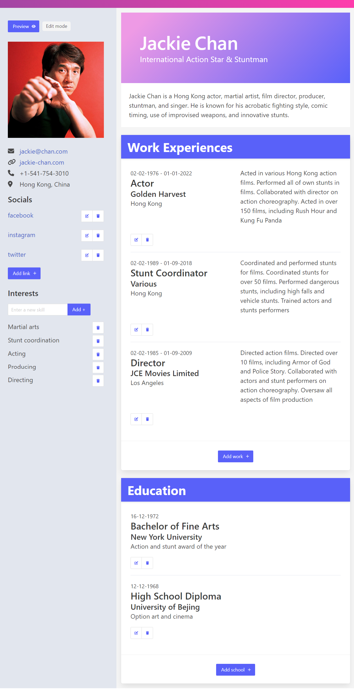

# React Resume app

The project is to create an app that can generate a resume in ReactJS.
The page consist of several form elements that gets updated with user input.
It is bootstraped with Vite.js.

🔗 **Live preview:** [here](https://velvety-treacle-40877e.netlify.app/)

### Screenshot

## Built with

### Technologies

- HTML
- CSS
- React JS

### Tools

- Vite
- Bulma

## Features

- Editable sections of the resume

## What I learned

- Better knowledge of working with forms and **React**
- Passing objects with state
- Conditional rendering of form elements within the UI

## Todo

- Implement the PDF export using [React PDF](https://www.npmjs.com/package/react-pdf) or similar
- Have the option to put 'on going' for the Work end date

## Author

👤 **Edouard Desgrée**

- GitHub: [edesgree](https://github.com/edesgree)

#### Created while working on the [The Odin Project](https://www.theodinproject.com/) and a [scrimba](https://scrimba.com/) class
